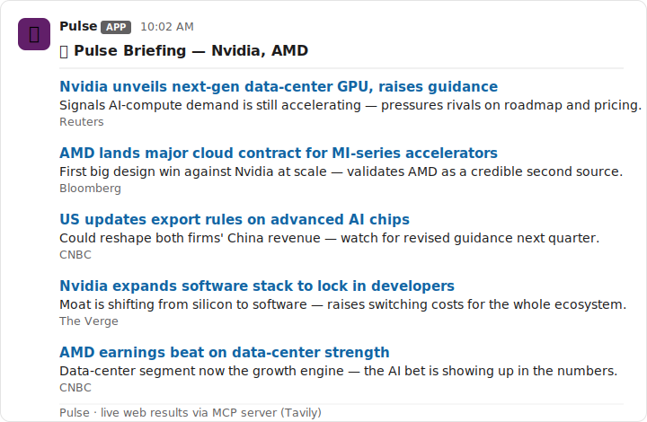

# Pulse — a Slack market-intelligence agent

Pulse posts short, cited market/competitive briefings into a Slack channel.
Built for the Slack Agent Builder Challenge, aimed at the Slack Marketplace.



*Example: `/pulse Nvidia, AMD` → a cited briefing posted in the channel (illustrative).*

**How it works:** when someone runs `/pulse <topics>` or @-mentions the bot,
Pulse retrieves recent news through a **search MCP server** (via the Anthropic
MCP connector), asks Claude to summarize *what matters*, and posts a clean
briefing back into the channel.

```
Slack message  →  Pulse (this code)  →  [MCP search server] + [Claude summary]  →  briefing posted to Slack
```

**MCP server integration (hackathon requirement):** Pulse satisfies the Slack
Agent Builder Challenge rule "use at least one of {Slack AI, MCP server
integration, Real-Time Search}" via **MCP**. When a search MCP server is
configured (a free `TAVILY_API_KEY`, or any `MCP_SERVER_URL`), Pulse attaches it
to the Claude call with the Messages API MCP connector and retrieves through it
— the response contains `mcp_tool_use` blocks as proof. If no MCP server is
configured it falls back to Claude's built-in web search so demos never break.

---

## See it work right now (no setup, no accounts)

```bash
npm install
npm run dry-run
```

This prints a sample briefing to your terminal — the exact thing Pulse will
post into Slack. Nothing here calls Slack or Claude yet; it's just to see the
shape of the output.

---

## Connecting it to a real Slack workspace

This is the part **you** do once (it needs accounts that only you can create).
Take it slow — each step is a few clicks.

### 1. Create a Slack workspace to test in
Go to https://slack.com/get-started and make a free workspace (e.g. "Pulse Dev").
This is your private sandbox.

### 2. Create a Slack app
- Go to https://api.slack.com/apps → **Create New App** → **From scratch**.
- Name it "Pulse", pick your sandbox workspace.

### 3. Turn on Socket Mode
- Left sidebar → **Socket Mode** → toggle **Enable Socket Mode** on.
- When prompted, create an **App-Level Token** with the `connections:write`
  scope. Copy it — this is your `SLACK_APP_TOKEN` (starts with `xapp-`).

### 4. Add a slash command
- Left sidebar → **Slash Commands** → **Create New Command**.
- Command: `/pulse`  ·  Description: "Get a market briefing"  ·  Usage hint: `Anthropic, OpenAI`
- (With Socket Mode on, you can leave the Request URL blank.)

### 5. Add bot permissions
- Left sidebar → **OAuth & Permissions** → **Scopes** → **Bot Token Scopes**, add:
  - `commands` (for the slash command)
  - `chat:write` (to post messages)
  - `app_mentions:read` (to hear @-mentions)

### 6. Subscribe to the mention event
- Left sidebar → **Event Subscriptions** → toggle on → under **Subscribe to bot events**
  add `app_mention`. Save.

### 7. Install the app to your workspace
- Left sidebar → **Install App** → **Install to Workspace** → Allow.
- Copy the **Bot User OAuth Token** (starts with `xoxb-`) → this is `SLACK_BOT_TOKEN`.
- The **Signing Secret** is on **Basic Information** → `SLACK_SIGNING_SECRET`.

### 8. Fill in your keys
```bash
cp .env.example .env
# open .env and paste in the three SLACK_ values
```

### 9. Run it
```bash
npm start
```
In Slack, invite the bot to a channel (`/invite @Pulse`), then type `/pulse Tesla, Rivian`.
You should see a briefing appear.

---

## Project layout

| File | What it does |
|------|--------------|
| `app.js` | Entry point. Dry-run preview, or connect to Slack and handle `/pulse` + @-mentions. |
| `src/briefing.js` | Retrieval (MCP server → web_search → sample) + Claude summary + Slack formatting. |
| `.env.example` | Template for your secret keys. Copy to `.env`. |

## What's next (build roadmap)
1. ✅ Repo + runnable skeleton with a sample briefing.
2. ✅ Live retrieval via a search MCP server (Anthropic MCP connector), web_search fallback.
3. ✅ Claude writes the "why it matters" line from each result.
4. ⬜ Scheduled daily briefings to a channel.
5. ⬜ Polish, demo video, Marketplace submission.
